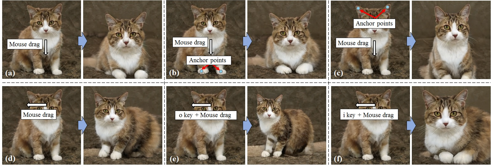
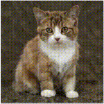
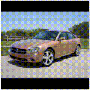
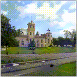

# User-Controllable Latent Transformer for StyleGAN Image Layout Editing
  <a href="https://arxiv.org/abs/2208.12408"></a>
  <a href="https://opensource.org/licenses/MIT"></a>
  <a href="https://huggingface.co/spaces/radames/UserControllableLT-Latent-Transformer" target="_blank">
    
  </a>
<p align="center">

</p>

This repository contains our implementation of the following paper:

Yuki Endo: "User-Controllable Latent Transformer for StyleGAN Image Layout Editing," Computer Graphpics Forum (Pacific Graphics 2022) [[Project](http://www.cgg.cs.tsukuba.ac.jp/~endo/projects/UserControllableLT)] [[PDF (preprint)](http://arxiv.org/abs/2208.12408)]

## Prerequisites  
1. Python 3.8
2. PyTorch 1.9.0
3. Flask
4. Others (see env.yml)

## Preparation
Download and decompress <a href="https://drive.google.com/file/d/1lBL_J-uROvqZ0BYu9gmEcMCNyaPo9cBY/view?usp=sharing">our pre-trained models</a>.

  Or you can dowload it from [Hugging Face hub](https://huggingface.co/radames/UserControllableLT)

```bash
git clone https://huggingface.co/radames/UserControllableLT pretrained_models
```

## Inference with our pre-trained models
<br>
We provide an interactive interface based on Flask. This interface can be locally launched with
```
python interface/flask_app.py --checkpoint_path=pretrained_models/latent_transformer/cat.pt
```
The interface can be accessed via http://localhost:8000/.

## Training
The latent transformer can be trained with
```
python scripts/train.py --exp_dir=results --stylegan_weights=pretrained_models/stylegan2-cat-config-f.pt
```
To perform training with your dataset, you need first to train StyleGAN2 on your dataset using [rosinality's code](https://github.com/rosinality/stylegan2-pytorch) and then run the above script with specifying the trained weights. 

## Link
[Gradio demo](https://huggingface.co/spaces/radames/UserControllableLT-Latent-Transformer) by Radam&#233;s Ajna

## Citation
Please cite our paper if you find the code useful:
```
@Article{endoPG2022,
Title = {User-Controllable Latent Transformer for StyleGAN Image Layout Editing},
Author = {Yuki Endo},
Journal = {Computer Graphics Forum},
volume = {41},
number = {7},
pages = {395-406},
doi = {10.1111/cgf.14686},
Year = {2022}
}
```

## Acknowledgements
This code heavily borrows from the [pixel2style2pixel](https://github.com/eladrich/pixel2style2pixel) and [expansion](https://github.com/gengshan-y/expansion) repositories. 
